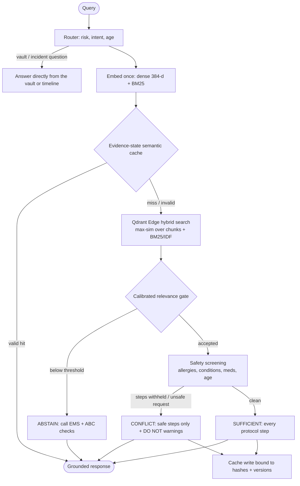
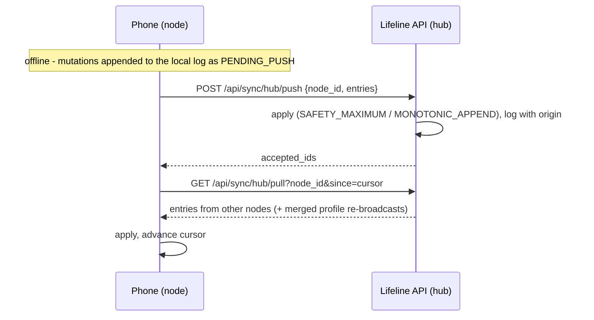

# Lifeline Architecture Specification

> **Risk-Aware Adaptive Emergency Memory for Edge Devices**  
> *"Your emergency memory. Even when the network isn't there."*

---

## 1. System overview

Lifeline is built on one non-negotiable tenet:

> **THE CLOUD SHOULD ENHANCE THE DEVICE. THE CLOUD MUST NOT BE REQUIRED FOR BASIC EMERGENCY MEMORY.**

The same engine runs in two places:

| | Backend node (`apps/api`, `edge/`) | Phone (`apps/mobile`) |
| :--- | :--- | :--- |
| Vector engine | Qdrant Edge (`qdrant-edge-py`) | Qdrant Edge (`qdrant_edge` Dart/UniFFI) |
| Dense embeddings | bge-small-en-v1.5 ONNX via FastEmbed | the same ONNX file via ONNX Runtime |
| Sparse embeddings | Qdrant Edge `Bm25` | bit-exact Dart port (tested against Python) |
| Protocol vectors | embedded at index time | precomputed in the knowledge pack |
| Role in sync | client **and** hub | client |



---

## 2. Storage

Source of truth is a set of JSON stores written atomically (write + fsync + rename). Qdrant Edge is a derived
index, reconciled on start-up (`edge/bootstrap.py`; `Lifeline._reconcileIndex` on the phone): only items whose
content hash changed are re-embedded.

Each memory tier is one `EdgeShard` with:

* named dense vector `dense` - 384-d, cosine
* named sparse vector `bm25` - modifier `IDF` (required for real BM25 scoring)

Each evidence item becomes:

* **one doc point** - BM25 vector of the full text (title, content, tags, triggers) and the full item as payload
* **N chunk points** - dense vectors of the title, each trigger phrase and each step

A `manifest.json` records the schema version and dense model. If either changes, the shards are rebuilt so
vectors from different embedding spaces are never mixed. If the dense model cannot load, the system runs in a
stricter **lexical-only** mode instead of substituting pseudo-vectors.

---

## 3. Retrieval and the relevance gate

For a query the shard returns, per evidence item, `dense_score` (max cosine over its chunks) and `bm25_score`.
They are fused as

```
confidence = dense_score + 0.015 * min(bm25_score, 10)
```

and a protocol is accepted only if `confidence >= 0.79`, `dense_score >= 0.72` and `bm25_score >= 0.5`
(lexical-only mode: `bm25 >= 6` with a 1.5 margin over the runner-up). Constants live in
`data/retrieval_config.json` and are shared with the phone through the knowledge pack.

Rank-only fusion (RRF) is deliberately not used for the decision: it discards the score magnitudes that separate
"relevant" from "merely the closest thing", which is exactly how an off-topic question used to receive a protocol.

**Calibration** (`tests/eval/retrieval_eval.json`, 60 labelled queries): in-domain confidence ≥ 0.82, off-domain and
no-protocol ≤ 0.77. Both implementations must answer all 60 correctly (`tests/test_eval_set.py`,
`apps/mobile/test/pipeline_eval_test.dart`, and on-device `integration_test/app_test.dart`).

When the patient's age is known, a protocol for that population (`metadata.population`) is preferred among the
accepted ones (infant CPR over adult CPR).

---

## 4. Safety screening

`edge/runtime/safety.py` (and `lib/engine/safety.dart`) builds a `SafetyContext`:

| Source | Example | Effect |
| :--- | :--- | :--- |
| Allergy (normalised + class expansion) | `NSAIDs (Ibuprofen, Naproxen)` | withhold steps mentioning nsaid, ibuprofen, naproxen, aspirin, … |
| Condition / medication | GI bleeding, warfarin | withhold aspirin / NSAID steps |
| Condition | pregnancy | withhold abdominal thrusts |
| Age | infant | withhold adult choking technique, insert infant back-blow/chest-thrust step |
| Age | child, adolescent | withhold aspirin |
| Condition | asthma, diabetes, epilepsy | caution only |

Verdicts:

* **SUFFICIENT** - accepted protocol, nothing withheld: every step, verbatim.
* **CONFLICT** - steps withheld or the question asks to give something unsafe: remaining steps, struck-through
  withheld steps with reasons, `DO NOT GIVE …` warnings, escalation.
* **INSUFFICIENT** - gate rejected: no protocol is shown; fixed "call EMS + ABC" fallback.

The owner's profile is applied unless the query clearly describes someone else ("my father", "a stranger") or a
different age group. Ambiguous wording ("the patient") keeps it applied, since a responder may be using the
owner's phone.

---

## 5. Evidence-state semantic cache

| Check | Why |
| :--- | :--- |
| cosine ≥ 0.96 / 0.94 / 0.92 / 0.90 (critical → low) | paraphrase reuse only |
| identical salient terms (negations, age words, drugs, allergens, numbers) | embeddings barely move between "breathing" and "not breathing" or between two drug names |
| same age group | infant vs adult answers differ |
| TTL 2 min … 1 h by risk | bounded staleness |
| profile version, incident version | patient state changed |
| hash of every cited trusted item | protocol revised |

INSUFFICIENT answers are never cached; the cache is LRU-bounded (256) and scanned with one matrix-vector product.

---

## 6. Replication



* **Personal** - SAFETY_MAXIMUM union of allergies, conditions and medications; contacts unioned by phone; other
  fields from the most recently edited side. If the hub's merge differs from what a node pushed, the hub
  re-broadcasts the merged profile so every node converges.
* **Trusted** - TRUSTED_AUTHORITY: strictly newer versions win; hubs reject protocols pushed by nodes.
* **Incident** - MONOTONIC_APPEND, de-duplicated by observation id.
* Push and pull are idempotent (entry ids, cursor), so a lost acknowledgement is harmless.
