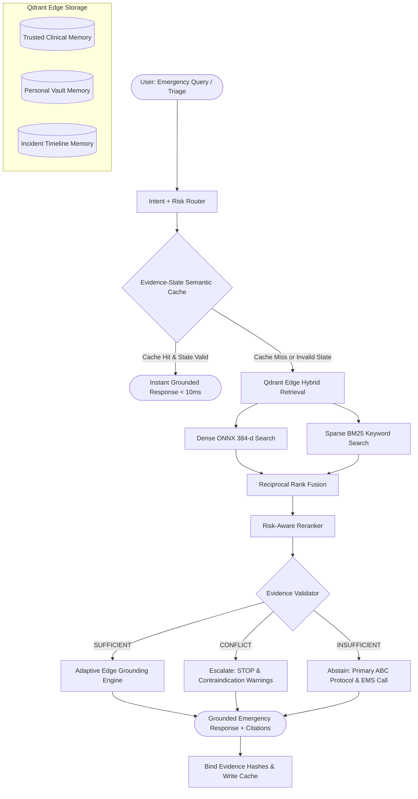
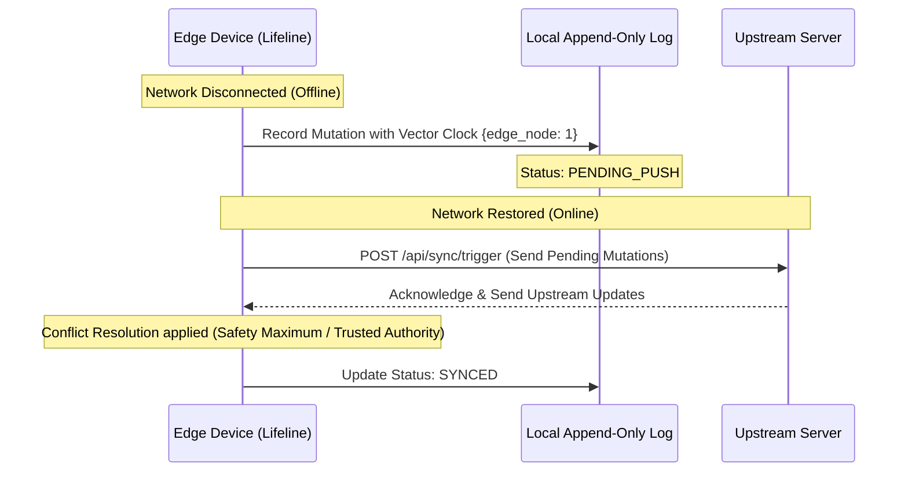

# Lifeline Architecture Specification

> **Risk-Aware Adaptive Emergency Memory for Edge Devices**  
> *"Your emergency memory. Even when the network isn't there."*

---

## 1. System Overview & Core Philosophy

Lifeline is built on a non-negotiable architectural tenet:

> **THE CLOUD SHOULD ENHANCE THE DEVICE. THE CLOUD MUST NOT BE REQUIRED FOR BASIC EMERGENCY MEMORY.**

During catastrophic network failure, natural disasters, or remote field emergencies, critical medical guidance and patient health history cannot be trapped behind an unreachable cloud API. Lifeline provides a completely autonomous, offline-first personal emergency memory system executed locally on edge devices.

---

## 2. The Three Memory Tiers

| Memory Tier | Collection Name | Purpose | Authority Weight | Conflict Strategy |
| :--- | :--- | :--- | :--- | :--- |
| **TRUSTED** | `lifeline_trusted_memory` | Clinical emergency protocols (CPR, Hemorrhage, Anaphylaxis, Asthma, Burns, Stroke). | `1.35x` | **TRUSTED_AUTHORITY** (Signed upstream clinical versions supersede local drafts). |
| **PERSONAL** | `lifeline_personal_memory` | Patient medical profile: Blood group, severe allergies, active medications, chronic illnesses, ICE contacts. | `1.25x` | **SAFETY_MAXIMUM** (Never delete an allergy; union of safety constraints). |
| **INCIDENT** | `lifeline_incident_memory` | Temporal on-scene timeline: Vitals (HR, SpO2, BP), symptoms observed, actions taken. | `1.15x` | **MONOTONIC_APPEND** (CRDT append-only log preserving chronological observations). |

---

## 3. Hybrid Dense + Sparse Retrieval & RRF

In high-stakes medical emergencies, neither pure dense semantic search nor pure keyword search is sufficient:
- **Dense Vectors (384-d Cosine via BAAI/bge-small-en-v1.5)** capture semantic meaning (e.g., *"victim unconscious, not breathing"* maps semantically to *Cardiopulmonary Resuscitation*).
- **Sparse BM25 Vectors** ensure precise exact-match retrieval for medication names, dosages, and emergency acronyms (*"EpiPen 0.3mg"*, *"Aspirin"*, *"AED"*, *"Tourniquet"*, *"Albuterol"*).

Ranks from both vectors are combined via **Reciprocal Rank Fusion (RRF)**:
$$RRF\_Score(d) = \frac{1.0}{k + \text{rank}_{dense}(d)} + \frac{1.0}{k + \text{rank}_{sparse}(d)}$$
where $k = 60$.

---

## 4. Evidence-State Semantic Cache

Traditional semantic caches produce fatal hallucinations in medical contexts if patient state or incident vitals change after caching.

Lifeline's **Evidence-State Semantic Cache** binds each cache entry to:
1. Dense query vector embedding.
2. Risk-Adaptive Cosine Thresholds:
   - `CRITICAL`: $\ge 0.96$ (TTL: 120s)
   - `HIGH`: $\ge 0.94$ (TTL: 300s)
   - `MEDIUM`: $\ge 0.90$ (TTL: 900s)
   - `LOW`: $\ge 0.88$ (TTL: 3600s)
3. Bound Evidence IDs and their SHA-256 content hashes.
4. Active Personal Profile Version.
5. Active Incident Timeline Version.

**State Invalidation Trigger**: If the user's allergy profile version increments, if on-scene responders log a new incident observation, or if a bound clinical protocol's hash mutates, the cache entry is immediately invalidated and purged.

---

## 5. Three-State Evidence Validator

The system strictly avoids generative hallucination through a 3-state clinical verdict:

1. **`SUFFICIENT`**: Evidence contains direct, verified instructions addressing the situation. The system proceeds to synthesize numbered action checklists with exact citations.
2. **`CONFLICT`**: Active contraindication detected (e.g. Protocol advises Aspirin, but personal vault contains Aspirin allergy or bleeding ulcer). The system halts the action, outputs an immediate **STOP** warning banner, and displays safe emergency alternatives.
3. **`INSUFFICIENT`**: Confidence score falls below clinical threshold or query is off-domain. The system **ABSTAINS** from guessing, surfaces 911/112 dispatch guidance, and provides primary Airway-Breathing-Circulation protocols.

---

## 6. Offline-First Sync & Conflict Resolution

- **Personal Profile**: Resolved using **Safety Maximum**. If remote and local profiles conflict, allergies and chronic conditions are unioned so no safety restriction is ever lost.
- **Trusted Protocols**: Resolved using **Trusted Authority**. Signed medical revisions supersede local edits.
- **Incident Timeline**: Monotonically appended CRDT log.
